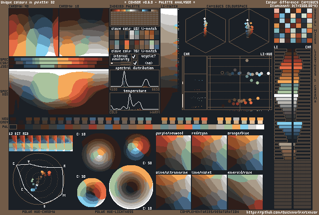
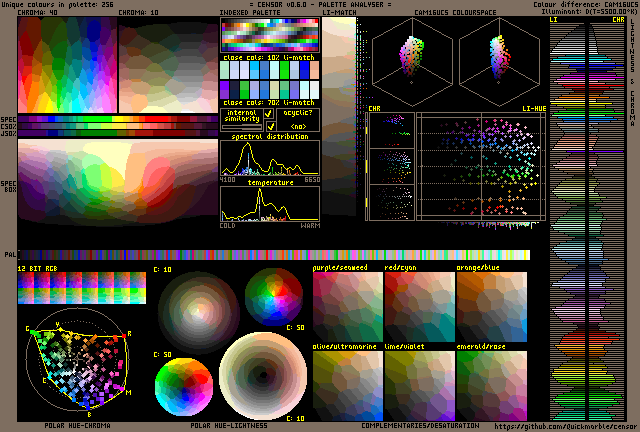

# Censor
[](https://crates.io/crates/censor-analyser)

`censor` is a standalone palette analyser inspired by DawnBringer's Palette Analyser for GrafX2 and having a compatible layout.
It helps creating and evaluating restricted palettes by providing visualisations and highlighting certain properties.

## Examples




## Installation
Install the rust toolchain using `rustup` or the repository. Then run:
```
$ cargo install censor-analyser
```

## Usage
To see all the flags and descriptions, pass
`--help` to `censor` and its subcommands.
### `censor analyse`
The default output is written into `plot.png`
in the working directory even if the file exists.
Specify another output file with `-o another.png` argument.
To use black, grey and white for UI instead of
choosing palette colours, pass the `-g` flag.
The illuminant is a daylight illuminant
with the white point generated by the temperature T
in Kelvins, 5500 by default;
the option `-T` may be used to redefine T;
the option `-D` may be used for the following presets:
`-D50`, `-D55`, `-D65`.
If the input image is png or jpeg and it
has an embedded colour profile, that
profile will be copied into the analysis image.

Analyse a palette from an image `input.png`:
```
$ censor analyse -i input.png
```
Analyse a palette from a text file `input.hex`:
```
$ censor analyse -f input.hex
```
Analyse a palette from manually specified hexcodes `2e3037,ebe5ce`:
```
$ censor analyse -c 2e3037,ebe5ce
```
Analyse a palette from lospec.com `aurora`:
```
$ censor analyse -l aurora
```
### `censor compute`
Palette input and illuminant options are the same as for `censor analyse`.
In addition, there are options for specifying which metrics should be
computed.
`-a, --all` activates all the metrics.
There are also flags for individual metrics (see the help page).
The output is formatted in csv to be script-friendly.
### `censor daemon`
Start daemon mode on port `8008`:
```
$ censor daemon -p 8008
```
Once the daemon is running, send commands
after connecting to the port (one command per connection).
The syntax is the same as for the command-line app, but:
1. You should omit the first `censor`.
2. The `daemon` command is not available.
3. The `-o` option for `analyse` is no longer optional.

An example of a valid palette analysis request
(assuming that the daemon is started on port 9876
on a Linux/Mac machine):
```
$ echo "analyse -l antiquity16 -o plot.png" | nc localhost 9876
```

On success, `OK` is returned. On error, `ERR` is returned and
more error info is printed in the next lines and also into daemon's `stderr`.

## Features
- Analyse palettes of 2-256 colours
- All widgets use CAM16UCS with perceptual colour distances
- Load colours from command line arguments, text files, images and Lospec
- Daemon mode for large amounts of analysis requests
- WASM support for analysing palettes on web pages client-side (currently broken)

## Widgets available
- Rectangular hue-lightness with fixed chroma
- Spectral colours (with the non-spectral CIExy line added)
- Spectral box (with `y` parametrising a parabola going through pure black, the spectral colour and pure white)
- Indexed palette
- Close colours (with different lightness weights)
- Internal similarity (which is `(mean_d/min_d)/n^(2/3)`)
- Acyclic check
- "Spectral" distribution (from hue-mapping nearest spectral colours relative to the white point)
- "Temperature" distribution (normalised `-log(CCT)`, might be changed later)
- Greyscale with differing lightness weights
- Cubes showing the colours in CAM16UCS space from different angles
- Hue-lightness plot
- Useful colour mixes (i.e. producing points that are further from other palette points)
- Lightness-chroma bars
- Lightness-sorted colours and neutralisers
- 12-bit RGB approximation
- Polar hue-chroma plot
- Polar hue-lightness with fixed chroma levels
- Complementaries
